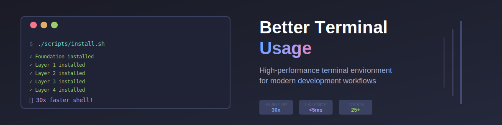

# awesome-terminal-for-ai



**The zsh-first terminal toolkit for AI-agent workflows** — evidence-based
verdicts on the best terminal tooling as of **July 2026**, a curated
`Brewfile`, and reference zsh configs with a built-in **agent-neutralization
gate** so five AI CLI harnesses (Claude Code, Codex, OpenCode, Antigravity,
MiMoCode) get clean pipes while humans get a fast, beautiful shell.

Design constraints this spec is built around:

- **Local machines write and check code.** Linters, LSPs, type checkers,
  formatters, quality gates — yes. Docker, local clusters, service hosting —
  no; everything runs on remote servers.
- **Agents are first-class terminal users.** Every pick is judged on pipe
  behavior, JSON output, exit-code discipline and startup latency, not just
  human ergonomics.
- **Evidence over folklore.** Verdicts carry versions from a primary-source
  GitHub/registry sweep (2026-07-07) — see [`TOOLKIT.md`](TOOLKIT.md).

## Quickstart

```bash
brew bundle --file Brewfile        # the curated terminal layer
# review, then adopt the reference configs:
cp configs/zsh/.zshenv  ~/.zshenv
cp configs/zsh/.zprofile ~/.zprofile
cp configs/zsh/.zshrc   ~/.zshrc
cp configs/zsh/.zsh_plugins.txt ~/.zsh_plugins.txt
mkdir -p ~/.config && cp configs/starship/starship.toml ~/.config/starship.toml
```

Full workstation provisioning (LSP fleet, linters, pinned AI CLIs, browser
providers) is owned by
[`rldyour-new-mac-or-ubuntu`](https://github.com/NDDev-it-com/rldyour-new-mac-or-ubuntu);
harness configs by
[`rldyour-ai-cli-tools`](https://github.com/NDDev-it-com/rldyour-ai-cli-tools).
This repo is the terminal-layer spec on top of them.

## Highlights (July 2026)

| Layer | Verdict |
|---|---|
| Emulator | **Ghostty 1.3** (scrollback search, agent-log throughput) |
| Shell stack | zsh + **antidote** + autosuggestions + fzf-tab + syntax-highlighting (last) |
| Prompt / history | **starship** · **atuin** (daemon, sqlite self-host, no Docker) |
| Find / navigate | **fzf** · **zoxide** · **yazi** · **lazygit** |
| Structured data | **jq** (canonical) + jaq sidecar · **yq** · **DuckDB** · jnv |
| Agent-native | **ast-grep** · **repomix** · xh (`--curl`) · scc · delta (+`git dft`) |
| Sessions | tmux 3.7 on servers; none needed locally |

The full tables, runner-ups, cut list (httpie, dasel, powerlevel10k, zinit,
zsh-autocomplete, WezTerm, Warp…) and agent-fit rules live in
[`TOOLKIT.md`](TOOLKIT.md).

## The engine that lives here

[`rldyourterm/`](https://github.com/rldyourmnd/rldyourterm) — a from-scratch
GPU terminal engine (Rust · portable-pty · winit · wgpu, 15 crates) built to a
stability-first contract, parked at its MVP (`550d78f`, 2026-03). The v1.0
design corpus is preserved under [`planning/`](planning/HISTORICAL.md) as
engineering history. Daily-driver verdict meanwhile: Ghostty.

## License

MIT for this specification repo; the `rldyourterm` engine carries its own
license. See [`LICENSE`](LICENSE), [`SECURITY.md`](SECURITY.md),
[`CONTRIBUTING.md`](CONTRIBUTING.md).
